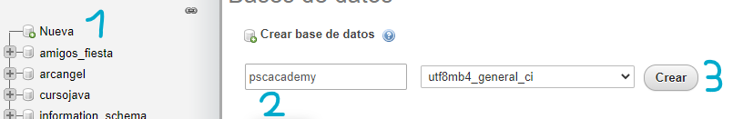
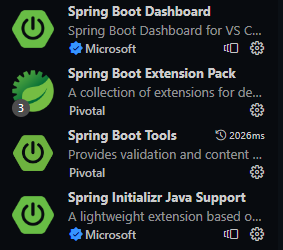
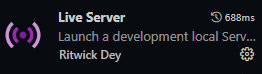
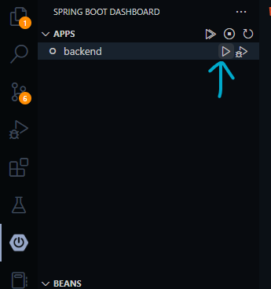

# PCSACADEMY 🎄

<h2 align=center><b> Presentamos la versión mas estable de la academia de conduccion <a href=https://github.com/PsylanL/PCSACADEMY>versión 0.3.0</a></b></h2>

<br>

# <div align=center><a href="#"></a></div>

## License

Code in this repository is distributed under the terms of the BSD 3-Clause
License (BSD-3-Clause).

See [LICENSE] for details.

[license]: LICENSE

# Como instalar el proyecto

- Para poder desplegar este proyecto de manera local en la base de datos SQL necesitaremos primeramente instalar una version de xampp para poder desplegar tambien de manera local la base de datos SQL y cuando se abra phpmyadmin crear una base de datos que se llame pcsacademy 



- Tambien necesitaremos tener la version de jdk 17, se recomienda esta version para evitar inconvenientes, se verifica la verison de java ejecutando en cmd el comando java --version

- Cuando se tenga la base de datos y la verison de java verificada se procedesa a instalar las extensiones de visual studio code correspondientes a el framework SpringBoot



- Tambien necesitaremos la extension de live server para ejecutar el frontend



- Si todo ha ido bien y tenermos en proyecto abierto, visual studio code desplegara en su barra de herramientas el logo de spring y para ejecutar primero asegurarse que la base de datos esta desplegada y se selecciona el boton para ejecutar el proyecto SpringBoot 




- Para poder iniciar sesion en la pagina web se debera tener un usuario administrador, y se debera crear directamente en la base de datos, para esto una vez SpringBoot se haya ejecutado ejecuta el siguiente script en la base de datos, cambiar los campos de nombre, apellido, email y telefono por los que se deseen IMPORTANTE: no cambiar el campo contraseña, al ser encriptada sera "123" a la hora de iniciar sesion 

``` SQL
INSERT INTO `admin` (`id`, `email`, `lastname`, `name`, `password`, `phone`, `years`) VALUES ('1', 'youremail@gmail.com', 'your lastname', 'your name', '$argon2id$v=19$m=1024,t=1,p=1$W+I6pfl0QDs5AiZHpHpTFw$txhaB7uAh6ZKezeZcUhw8eiWpSRaz7Ke84VQZmVcf8U', '3333333333', '18')
 ```

